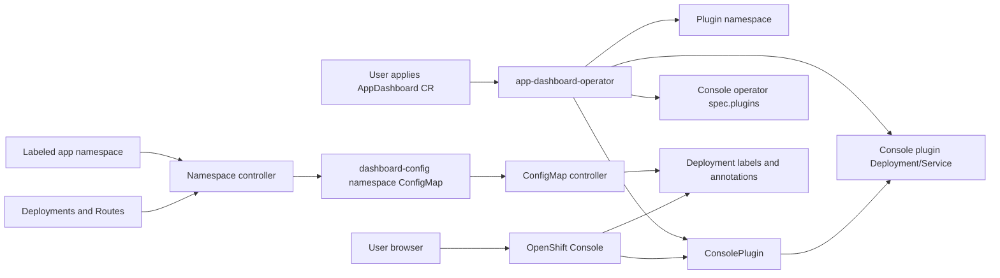

# Architecture

## Components



## Reconciliation Responsibilities

### AppDashboardReconciler

Source file: `controllers/appdashboard_controller.go`

Owns installation of the dashboard console plugin. It creates or patches:

- `Namespace`
- `ServiceAccount`
- nginx `ConfigMap`
- HTTPS `Service` using OpenShift serving certs
- plugin `Deployment`
- `ConsolePlugin`
- optional `ConsoleLink`
- optional `operator.openshift.io/v1 Console/cluster` plugin enablement

This replaces the former separate Helm install path for day-to-day use. The Helm chart under `console-plugin/charts/` remains useful as reference material, but the operator path should be preferred.

### NamespaceReconciler

Source file: `controllers/namespace_controller.go`

Watches:

- `Namespace`
- `Deployment`
- `Route`

When a namespace is labeled with `dashboard.yamlwrangler.com/enabled=true`, it ensures a `dashboard-config-<namespace>` ConfigMap exists. On later deployment or route changes, it merges newly discovered deployments into the existing configmap without overwriting manual app entries.

### ConfigMapReconciler

Source file: `controllers/configmap_controller.go`

Watches configmaps labeled:

```text
dashboard.yamlwrangler.com/type=namespace-config
```

It parses `config.yaml`, resolves route names in `customLinks`, and applies the dashboard label/annotations to deployments.

### DashboardAppGroupReconciler

Source file: `controllers/dashboardappgroup_controller.go`

Supports explicit named/regex/label selection of deployments. This is useful when an app is made of multiple deployments and you want a CR-driven grouping model instead of editing the generated namespace configmap.

## Frontend Data Contract

The console plugin in `console-plugin/` watches:

- Deployments labeled `dashboard.yamlwrangler.com/enabled=true`
- Routes
- ConfigMaps labeled `dashboard.yamlwrangler.com/type=custom-link`

The operator should continue to write deployment metadata in the format the plugin expects. If this contract changes, update both `controllers/` and `console-plugin/src/components/AppDashboardPage.tsx` together.

## Images

There are still two runtime images:

- Operator image: built from the repo root `Dockerfile`
- Console plugin image: built from `console-plugin/Dockerfile`

The repo is consolidated, but the runtime separation is intentional. The operator reconciles a deployment that serves static frontend assets, so the plugin image should remain separately versioned unless a future design embeds assets directly in the operator.

## OLM Install Path

Use `./build-and-deploy.sh --olm` when the operator should appear in the OpenShift Console Installed Operators UI:

```bash
oc get csv -n app-dashboard-operator
```

That path applies:

- `manifests/olm/operatorgroup.yaml`
- `manifests/olm/serviceaccount.yaml`
- `manifests/olm/app-dashboard-operator.clusterserviceversion.yaml`

The CSV icon is sourced from the Yamlwrangler website header mark in `~/git/yamlwrangler-home/src/App.jsx`: a lucide `Boxes` glyph in the red/dark rounded square treatment. The reusable SVG lives at `manifests/olm/icon.svg`, and its base64 form is embedded in `spec.icon` in the CSV.

Raw manifests are still useful for quick development, but direct CSV application does not create the OLM `operators.operators.coreos.com` summary object shown by `oc get operator`. That summary object requires a catalog/subscription install path.
