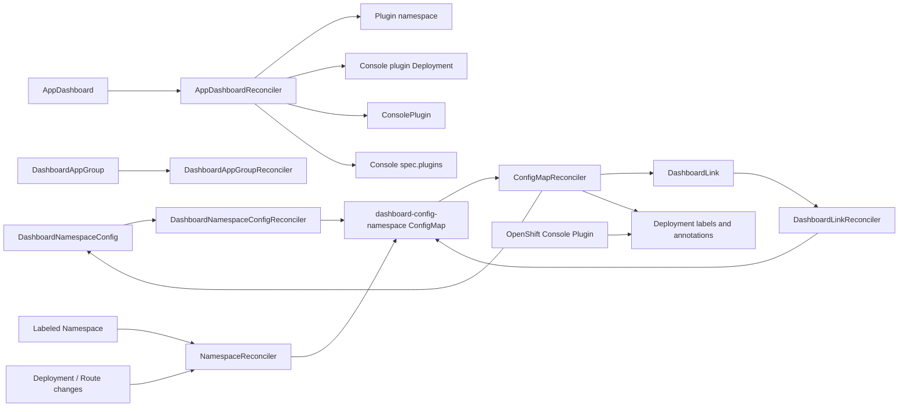

# Architecture

## Reconciliation Flow



## Controllers

### AppDashboardReconciler

Installs and maintains the console plugin workload:

- Namespace
- ServiceAccount
- nginx ConfigMap
- HTTPS Service with OpenShift serving certificate annotation
- Deployment
- ConsolePlugin
- optional ConsoleLink
- optional `Console.operator.openshift.io/cluster.spec.plugins` entry

### DashboardNamespaceConfigReconciler

Creates or updates `dashboard-config-<namespace>` from a typed CR.

Discovery modes:

- `Merge`: preserve existing ConfigMap apps, add discovered deployments, overlay CR fields.
- `Replace`: rebuild from discovery, then overlay CR fields.
- `None`: do not discover deployments; only reconcile declared CR fields into existing config.

This is the primary API for Operator UI based ConfigMap management.

### DashboardLinkReconciler

Adds or updates a single custom link in `dashboard-config-<namespace>`.

Use this when the user only needs to add an external link or route-backed link
without editing a full namespace config object.

### NamespaceReconciler

Watches namespaces, deployments, and routes. For namespaces labeled
`dashboard.yamlwrangler.com/enabled=true`, it creates or merges generated app
entries into the namespace ConfigMap.

### ConfigMapReconciler

Watches ConfigMaps labeled:

```text
dashboard.yamlwrangler.com/type=namespace-config
```

It parses `config.yaml`, imports existing namespace ConfigMaps and standalone
custom-link ConfigMaps into typed operands, resolves route names in custom links,
and writes the deployment labels/annotations consumed by the console plugin.

For import, it creates or updates:

- one `DashboardNamespaceConfig` named after the ConfigMap
- one `DashboardLink` per custom link

Only operands marked with `dashboard.yamlwrangler.com/imported-from-configmap`
are updated by the importer. User-created operands are left alone.

The namespace controller also backfills `DashboardNamespaceConfig` from current
dashboard-labeled deployments. This captures the live state used by the console
plugin when no `dashboard-config-*` ConfigMap exists yet.

### DashboardAppGroupReconciler

Selects deployments by name, regex, or labels, then applies group metadata and
dashboard labels/annotations.

## Frontend Data Contract

The console plugin consumes deployment labels/annotations:

- `dashboard.yamlwrangler.com/enabled=true`
- `dashboard.yamlwrangler.com/display-name`
- `dashboard.yamlwrangler.com/category`
- `dashboard.yamlwrangler.com/description`
- `dashboard.yamlwrangler.com/app-group`
- `dashboard.yamlwrangler.com/primary-route`
- `dashboard.yamlwrangler.com/custom-links`

Keep controller output and `console-plugin/src/components/AppDashboardPage.tsx`
in sync.
